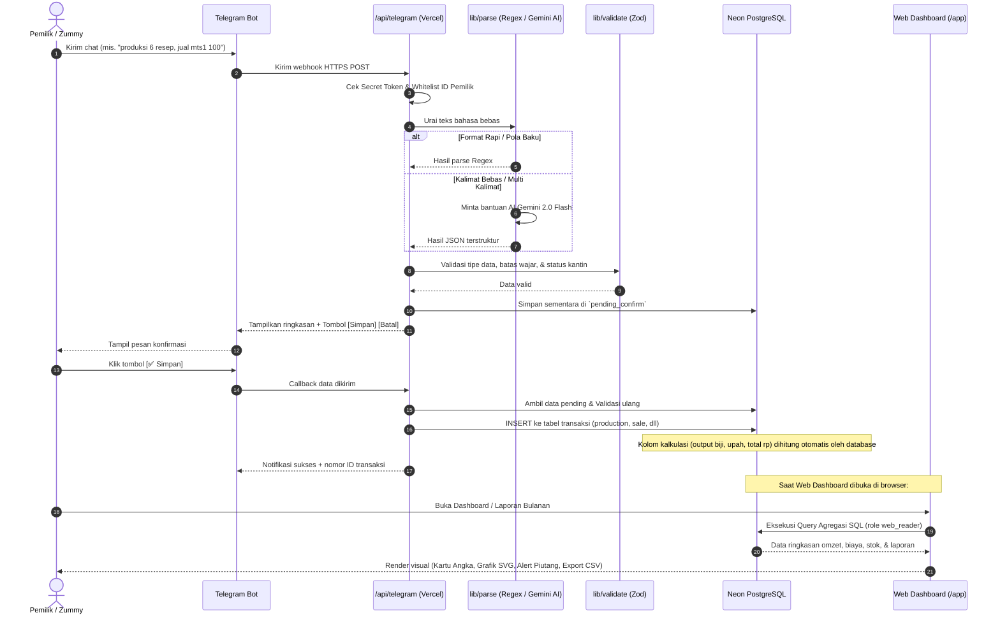

# Ringkasan Proyek: Es Lilin Tracker (Sistem Pencatatan Usaha Es Lilin)

Dokumen ini berisi gambaran menyeluruh mengenai arsitektur teknis, fitur, struktur data, formula perhitungan keuangan, dan alur kerja sistem pencatatan usaha es lilin yang ada di dalam proyek ini saat ini. Dokumen disusun dalam bahasa yang mudah dipahami agar dapat digunakan untuk evaluasi dan perbandingan dengan kebutuhan operasional bisnis riil.

---

## 1. Ringkasan Umum

### A. Tech Stack (Teknologi yang Digunakan)
Aplikasi ini dibangun dengan arsitektur modern berbasis *serverless* dan memanfaatkan layanan gratis (*free tier*):

- **Bahasa Pemrograman**: **TypeScript (Node.js)** — Memberikan keamanan tipe data (*type-safety*) dari hulu (bot) ke hilir (tampilan web).
- **Framework Web & API**: **Next.js 15 (App Router & React 19)** — Mengelola antarmuka dashboard web sekaligus menyediakan endpoint webhook untuk bot Telegram dalam satu proyek terpadu.
- **Database**: **PostgreSQL di Neon Database (Serverless Postgres)** — Database relasional yang menjadi satu-satunya sumber data (*single source of truth*), diakses menggunakan driver HTTP `@neondatabase/serverless`.
- **Query & ORM**: **Drizzle ORM** dan **Tagged-Template SQL Berparameter** — Menjamin kueri data terstruktur, efisien, dan aman dari celah manipulasi (*SQL Injection*).
- **Antarmuka Input (Bot)**: **grammY (Telegram Bot Framework)** dalam mode *Webhook* — Menerima input catatan usaha secara langsung melalui chat Telegram tanpa membutuhkan server/VPS yang menyala terus-menerus.
- **Kecerdasan Buatan (AI)**: **Google Gemini API (`gemini-2.0-flash`)** — Berfungsi sebagai penerjemah bahasa alami (*natural language parser*) ketika format pesan chat tidak baku.
- **Validasi Data**: **Zod** — Memeriksa seluruh data yang masuk (baik dari hasil olahan AI, regex, maupun form web) agar selalu sesuai batas logika bisnis sebelum disimpan ke database.
- **Grafik & Visualisasi**: **SVG & CSS Murni (Server-Rendered)** — Grafik garis tren, grafik batang kantin, dan donat komposisi biaya dirender langsung di server tanpa library pihak ketiga yang berat (seperti Recharts), sehingga halaman web sangat ringan dibuka dari smartphone.
- **Autentikasi & Keamanan**:
  - **Dua Peran Database Terpisah**: Role `bot_writer` (hanya untuk bot mencatat/mengoreksi data) dan role `web_reader` (hanya untuk web membaca data laporan).
  - **Keamanan Webhook Bot**: Verifikasi *Secret Token* dan pembatasan khusus pada ID Telegram Pemilik (*Whitelist ID*).
  - **Keamanan Web Dashboard**: Autentikasi berbasis password dengan cookie aman berenkripsi HMAC-SHA256.
- **Platform Deployment**: **Vercel** — Hosting serverless untuk frontend dan backend bot.

---

### B. Struktur Folder Utama dan Fungsinya

```text
es/
├── app/                        # Rute Halaman Web dan Endpoint API (Next.js App Router)
│   ├── api/
│   │   ├── login/              # API untuk proses masuk dan keluar (login/logout) dashboard
│   │   └── telegram/           # Endpoint Webhook penerima pesan dari Bot Telegram
│   ├── laporan/
│   │   ├── export/             # Endpoint download laporan keuangan format CSV
│   │   └── page.tsx            # Halaman Laporan Bulanan (Laba Usaha, Kas, Pengambilan)
│   ├── login/                  # Halaman antarmuka form login password web
│   ├── stok/                   # Halaman pemantauan sisa stok fisik es lilin per lokasi
│   ├── transaksi/              # Halaman riwayat gabungan seluruh catatan transaksi & audit
│   ├── layout.tsx              # Kerangka tampilan utama web (layout dasar & font)
│   ├── loading.tsx             # Tampilan transisi saat memuat data
│   ├── globals.css             # Desain styling antarmuka web (tampilan mobile-first)
│   └── page.tsx                # Halaman Beranda / Dashboard utama
│
├── components/                 # Komponen Tampilan Antarmuka Web (UI)
│   ├── charts.tsx              # Komponen visual grafik SVG (Tren Omzet, Bar Kantin, Donut Biaya)
│   └── nav.tsx                 # Navigasi bawah mobile (Bottom Nav) & tombol Logout
│
├── lib/                        # Inti Logika Bisnis & Utilitas Sistem
│   ├── schema.ts               # Skema database Drizzle (definisi tabel & kolom otomatis)
│   ├── db.ts                   # Manajemen koneksi database Neon (pemisahan bot vs web)
│   ├── locations.ts            # Manajemen data master lokasi/kantin (dinamis dari database)
│   ├── validate.ts             # Skema validasi Zod untuk seluruh transaksi & pengaturan
│   ├── parse.ts                # Pengurai pesan chat bot (tahap 1: Regex, tahap 2: Gemini AI)
│   ├── insert.ts               # Eksekutor simpan, ubah, hapus transaksi & pengaturan ke DB
│   ├── reports.ts              # Kueri SQL agregasi untuk menghitung metrik & laporan keuangan
│   ├── telegram.ts             # Konfigurasi bot Telegram, menu perintah, & tombol konfirmasi
│   ├── pending.ts              # Pengelola antrean konfirmasi sementara sebelum disimpan
│   ├── ask.ts                  # Logika tanya-jawab laporan otomatis di Telegram (tanpa AI)
│   ├── dates.ts                # Helper tanggal & waktu zona Asia/Jakarta (WIB, UTC+7)
│   ├── format.ts               # Formatter angka mata uang Rupiah
│   ├── auth.ts                 # Validasi password & pembuatan token sesi web
│   └── auth-shared.ts          # Konstanta nama cookie sesi web
│
├── db/                         # Skrip Database & Migrasi SQL
│   ├── migrations/             # Skrip migrasi struktur tabel (0001_init s/d 0008_opening_balance)
│   └── reset_data.sql          # Skrip SQL untuk mengosongkan data transaksi saat mulai ulang
│
├── scripts/                    # Skrip Utilitas
│   └── set-webhook.ts          # Skrip otomatis untuk mendaftarkan webhook bot ke server Telegram
│
├── tests/                      # Pengujian Otomatis (Unit Testing)
│   ├── parse.test.ts           # Uji coba penguraian pesan chat Telegram
│   └── validate.test.ts        # Uji coba aturan validasi logika bisnis
│
├── .env.example                # Template variabel lingkungan (environment variables)
├── CLAUDE.md                   # Panduan teknis arsitektur & aturan domain kode
├── PROJECT.md                  # Spesifikasi awal proyek
└── README.md                   # Petunjuk setup dan penggunaan aplikasi
```

---

## 2. Fitur yang Sudah Ada

Berikut adalah daftar seluruh fitur yang saat ini telah aktif dan berjalan di dalam kode:

### A. Input Catatan Usaha Lewat Bot Telegram (Bahasa Bebas & Multi-Operasi)
- **Deskripsi**: Pemilik dapat mencatat kegiatan usaha cukup dengan mengetik pesan di Telegram seperti sedang mencatat di buku/chat biasa.
- **Alur Kerja**:
  1. **Input**: Pengguna mengirim chat teks (misal: `"produksi 6 resep"`, `"kirim rumah->mts1 100"`, `"jual mts1 100"`, `"uang mts1 90rb"`, `"beli bahan 20rb"`, `"ambil ayah 31500 spp"`, atau gabungan: `"jual mts1 100, uang mts1 90rb"`).
  2. **Proses**:
     - Sistem memverifikasi keamanan pengirim (hanya akun Telegram pemilik yang dilayani).
     - Pesan diurai pertama kali menggunakan pola teks cepat (*Regex*). Jika formatnya bebas atau rumit, sistem meminta bantuan AI Gemini untuk menyusunnya menjadi data terstruktur.
     - Data divalidasi keamanannya (angka wajar, tanggal nyata, lokasi terdaftar).
     - Bot **tidak langsung menyimpan**, melainkan menampilkan ringkasan data beserta tombol pilihan `[✅ Simpan]` dan `[❌ Batal]`.
  3. **Output**: Setelah tombol `✅ Simpan` ditekan, data disimpan permanen ke database dan bot mengonfirmasi nomor ID transaksi yang berhasil dibuat.

### B. Revisi dan Koreksi Data Lewat Bot Telegram
- **Deskripsi**: Memungkinkan koreksi kesalahan pencatatan secara cepat tanpa harus membuka database.
- **Alur Kerja**:
  1. **Input**: Perintah `undo` (batalkan yang terakhir), `hapus <jenis> <id>` (misal: `hapus jual 12`), atau `ubah <jenis> <id> jadi <nilai>` (misal: `ubah mutasi 5 jadi 80`).
  2. **Proses**: Sistem mencari baris data terkait, menampilkan rincian data lamanya, dan memunculkan tombol konfirmasi ralat `[🗑 Ya, hapus]` / `[✏️ Ya, ubah]`.
  3. **Output**: Baris data terhapus atau nilai utamanya (jumlah resep / jumlah es / nominal uang) terbarui di database.

### C. Tanya-Jawab Laporan Cepat di Bot Telegram (Deterministik / Tanpa Kuota AI)
- **Deskripsi**: Mengecek kondisi usaha terkini langsung dari jendela chat Telegram.
- **Alur Kerja**:
  1. **Input**: Kalimat pertanyaan seperti `cek stok`, `ringkasan hari ini`, `ringkasan kemarin`, `kemarin mts1 kirim berapa`, `mts1 jual berapa hari ini`, atau `transaksi terakhir`.
  2. **Proses**: Sistem membaca kata kunci pertanyaan dan langsung menjalankan perhitungan database.
  3. **Output**: Bot membalas berupa rangkuman angka (misal: total sisa stok di tiap kantin, omzet harian, kas masuk vs kas keluar, dll).

### D. Pengaturan Master Lokasi/Kantin & Saldo Awal (`/setting`)
- **Deskripsi**: Mengelola daftar sekolah/kantin titipan dan menentukan modal awal langsung lewat Telegram.
- **Alur Kerja**:
  1. **Input**: Perintah `/setting` (melihat daftar), `/setting lokasi <kode> <Nama> [harga] [batch50]` (menambah kantin), `/setting hapuslokasi <kode>` (menonaktifkan kantin), atau `/setting saldo <nominal>` (modal awal).
  2. **Proses**: Sistem memvalidasi parameter dan meminta konfirmasi tombol simpan, kemudian memperbarui tabel master.
  3. **Output**: Master kantin atau baseline saldo awal tersimpan dan langsung diterapkan pada perhitungan laporan.

### E. Dashboard Ringkasan Finansial Web (`/`)
- **Deskripsi**: Halaman beranda visual untuk memantau performa bisnis secara menyeluruh.
- **Alur Kerja**:
  1. **Input**: Memilih filter rentang waktu: **Hari ini**, **7 hari terakhir**, atau **Bulan ini**.
  2. **Proses**: Server menghitung total Omzet, Pengeluaran, Upah Produksi, Laba Usaha, Pengambilan Pribadi, dan Kas Tersisa.
  3. **Output**: Tampilan kartu metrik utama, grafik area tren omzet harian, grafik batang penjualan per kantin, grafik donat komposisi biaya, audit kantin yang perlu dicek, serta daftar transaksi terbaru.

### F. Pemantauan Selisih & Piutang Kantin ("Perlu Dicek")
- **Deskripsi**: Mendeteksi kantin yang sudah mencatat penjualan namun uang kasnya belum disetorkan secara penuh.
- **Alur Kerja**:
  1. **Input**: Dihitung otomatis saat membuka Dashboard atau menu Transaksi.
  2. **Proses**: Membandingkan `Total Penjualan (Omzet)` dengan `Total Kas Masuk` per masing-masing kantin pada periode yang dipilih.
  3. **Output**: Kotak peringatan (*Alert*) kuning berisi daftar kantin beserta nominal selisih uang yang belum diterima.

### G. Riwayat Transaksi Gabungan Web (`/transaksi`)
- **Deskripsi**: Buku besar digital yang menyatukan seluruh riwayat dari 5 aktivitas bisnis.
- **Alur Kerja**:
  1. **Input**: Memilih filter periode waktu dan filter jenis transaksi (Semua, Jual, Kas Masuk, Kas Keluar, Mutasi, Produksi).
  2. **Proses**: Mengambil dan menggabungkan data dari 5 tabel transaksi secara kronologis (terbaru di atas).
  3. **Output**: Daftar kartu transaksi lengkap dengan ID, tanggal, detail keterangan, dan indikator uang masuk (+) atau uang keluar (-).

### H. Pemantauan Stok Fisik Es Lilin (`/stok`)
- **Deskripsi**: Melacak keberadaan stok fisik es lilin yang tersisa di rumah (gudang) maupun di kantin titipan.
- **Alur Kerja**:
  1. **Input**: Membuka halaman `/stok`.
  2. **Proses**: Menghitung secara akumulatif: `(Es Masuk dari Produksi/Mutasi Masuk) - (Es Keluar ke Lokasi Lain) - (Es Terjual)`.
  3. **Output**: Kartu produksi hari ini & kemarin, total es yang keluar hari ini, serta tabel sisa es per lokasi (dengan tanda khusus untuk kantin berkulkas besar yang menggunakan sistem batch 50).

### I. Laporan Keuangan Bulanan & Export CSV (`/laporan`)
- **Deskripsi**: Laporan laba rugi dan posisi kas bulanan yang dapat diunduh ke Excel.
- **Alur Kerja**:
  1. **Input**: Memilih bulan transaksi dan mengklik tombol `⬇️ Export CSV`.
  2. **Proses**: Server menyusun rekap bulanan (Omzet, Pengeluaran, Upah per Pekerja, Laba Usaha, Saldo Awal, Pengambilan Pribadi, Kas Tersisa).
  3. **Output**: Tampilan tabel ringkas bulanan di web dan file unduhan spreadsheet `.csv` yang terlindungi dari celah keamanan formula Excel.

---

## 3. Struktur Data / Skema Database

Database menggunakan PostgreSQL di Neon dengan 8 tabel utama:

```mermaid
erDiagram
    LOCATION_REF ||--o{ STOCK_MOVEMENT : "asal & tujuan"
    LOCATION_REF ||--o{ SALE : "kantin tujuan"
    LOCATION_REF ||--o{ CASH_IN : "kantin penyetor"
    PRODUCTION ||--|| OPENING_BALANCE : "baseline modal"
    
    LOCATION_REF {
        text code PK "Kode unik (mis. rumah, mts1, sma)"
        text label "Nama tampilan kantin"
        smallint sort_order "Urutan tampilan"
        boolean is_canteen "True jika kantin tujuan jual"
        boolean is_warehouse "True jika gudang rumah"
        boolean is_batch50 "True jika model kulkas batch 50"
        smallint price_rp "Harga jual default per biji"
        boolean active "Status aktif/nonaktif"
    }

    PRODUCTION {
        bigint id PK "Auto Increment"
        date prod_date "Tanggal produksi"
        smallint recipes "Jumlah resep yang dibuat"
        worker worker "Pekerja (berdua / zummy / aril)"
        int output_pieces "Otomatis: recipes * 40"
        int wage_zummy_rp "Otomatis: upah Zummy"
        int wage_aril_rp "Otomatis: upah Aril"
        int wage_rp "Otomatis: total upah produksi"
        text note "Catatan"
    }

    STOCK_MOVEMENT {
        bigint id PK "Auto Increment"
        date move_date "Tanggal kirim/pindah"
        text from_loc FK "Lokasi asal"
        text to_loc FK "Lokasi tujuan"
        smallint qty "Jumlah biji es yang dipindah"
        text note "Catatan"
    }

    SALE {
        bigint id PK "Auto Increment"
        date sale_date "Tanggal laku/penjualan"
        text canteen FK "Kantin lokasi penjualan"
        smallint qty "Jumlah biji es terjual"
        smallint price_rp "Harga jual per biji (omzet kita)"
        int total_rp "Otomatis: qty * price_rp"
        text note "Catatan"
    }

    CASH_IN {
        bigint id PK "Auto Increment"
        date received_date "Tanggal uang kas diterima"
        text canteen FK "Kantin penyetor uang"
        int amount_rp "Nominal uang diterima (Rp)"
        payment_method method "Metode (cash / transfer)"
        text note "Catatan"
    }

    CASH_OUT {
        bigint id PK "Auto Increment"
        date out_date "Tanggal uang keluar"
        cashout_kind kind "Jenis: pengeluaran / pengambilan"
        expense_category category "Kategori biaya/tujuan"
        int amount_rp "Nominal uang keluar (Rp)"
        text note "Catatan keterangan barang"
    }

    OPENING_BALANCE {
        smallint id PK "Selalu bernilai 1"
        int saldo_awal_rp "Modal awal kas + nilai bahan"
        text note "Catatan modal"
        timestamptz updated_at "Waktu update"
    }

    PENDING_CONFIRM {
        text id PK "ID acak konfirmasi bot"
        jsonb payload "Data transaksi sementara"
        timestamptz created_at "Waktu dibuat"
    }
```



### Rincian Tabel dan Field:

1. **`production` (Catatan Pembuatan Es Lilin)**
   - `id`: Angka unik identitas baris.
   - `prod_date`: Tanggal pembuatan es.
   - `recipes`: Jumlah resep adonan yang dimasak (misal 4 s/d 8 resep).
   - `worker`: Pilihan siapa yang membuat (`berdua`, `zummy`, atau `aril`).
   - `output_pieces`: *Dihitung otomatis oleh database* = `recipes × 40` biji.
   - `wage_zummy_rp`: *Dihitung otomatis oleh database* = Upah untuk Zummy (Rp5.000/resep jika ikut).
   - `wage_aril_rp`: *Dihitung otomatis oleh database* = Upah untuk Aril (Rp5.000/resep jika ikut).
   - `wage_rp`: *Dihitung otomatis oleh database* = Total upah (`recipes × Rp10.000` bila berdua, atau `recipes × Rp5.000` bila sendiri).
   - `note`: Catatan tambahan (opsional).

2. **`stock_movement` (Catatan Perpindahan / Mutasi Es)**
   - `id`: Angka unik identitas baris.
   - `move_date`: Tanggal barang dipindahkan.
   - `from_loc`: Lokasi asal (mengacu ke `location_ref.code`).
   - `to_loc`: Lokasi tujuan (mengacu ke `location_ref.code`).
   - `qty`: Jumlah biji es yang dikirim/dipindahkan (tidak boleh bernilai 0 atau negatif).
   - `note`: Catatan (misal "sisa kemarin dipindah").

3. **`sale` (Catatan Penjualan / Es Laku)**
   - `id`: Angka unik identitas baris.
   - `sale_date`: Tanggal es terjual.
   - `canteen`: Kantin sekolah tempat es terjual (mengacu ke `location_ref.code`, tidak boleh gudang rumah).
   - `qty`: Jumlah biji es yang terjual.
   - `price_rp`: Harga jual kotor kita per biji dalam rupiah (default Rp1.300/biji, bisa diubah).
   - `total_rp`: *Dihitung otomatis oleh database* = `qty × price_rp` (Total omzet kotor).
   - `note`: Catatan tambahan (misal "batch 50").

4. **`cash_in` (Catatan Uang Masuk / Setoran Kantin)**
   - `id`: Angka unik identitas baris.
   - `received_date`: Tanggal uang fisik diterima.
   - `canteen`: Kantin yang menyerahkan uang.
   - `amount_rp`: Jumlah uang tunai/transfer yang diterima dalam Rupiah.
   - `method`: Cara pembayaran (`cash` atau `transfer`).
   - `note`: Catatan setoran.

5. **`cash_out` (Catatan Uang Keluar: Operasional & Pengambilan Pribadi)**
   - `id`: Angka unik identitas baris.
   - `out_date`: Tanggal uang dikeluarkan.
   - `kind`: Jenis pengeluaran:
     - `pengeluaran`: Biaya operasional usaha (mengurangi laba usaha).
     - `pengambilan`: Penarikan dana pribadi pemilik / *owner draw* (misal SPP anak yang diambil ayah — **tidak mengurangi laba usaha**, hanya mengurangi saldo kas).
   - `category`: Kategori belanja (`bahan`, `gas_listrik`, `plastik`, `transport`, `spp_ayah`, `lainnya`).
   - `amount_rp`: Nominal uang yang dikeluarkan dalam Rupiah.
   - `note`: Keterangan detail barang belanjaan.

6. **`location_ref` (Master Data Kantin & Gudang)**
   - `code`: Kode pendek lokasi (misal `rumah`, `mts1`, `sma`, dll).
   - `label`: Nama panjang tampilan (misal `MTS Negeri 1`).
   - `sort_order`: Urutan prioritas tampilan.
   - `is_canteen`: Bernilai `true` jika merupakan kantin titipan.
   - `is_warehouse`: Bernilai `true` jika merupakan gudang penyimpanan/rumah.
   - `is_batch50`: Bernilai `true` jika kantin menggunakan model kulkas (penjualan wajib kelipatan 50 dan stok fisik tidak dihitung harian).
   - `price_rp`: Harga jual default kita ke kantin tersebut.
   - `active`: Status kantin (`true` = aktif, `false` = dinonaktifkan/soft-delete).

7. **`opening_balance` (Saldo Awal Modal)**
   - `id`: Selalu 1 (tabel baris tunggal).
   - `saldo_awal_rp`: Nilai rupiah modal awal (uang kas + persediaan awal saat sistem mulai dipakai).
   - `note`: Catatan rincian modal.
   - `updated_at`: Waktu terakhir diubah.

8. **`pending_confirm` (Tabel Antrean Konfirmasi Bot Telegram)**
   - `id`: ID acak transaksi sementara (12 karakter hex).
   - `payload`: Dokumen JSON berisi rincian data yang menunggu pengguna menekan tombol Simpan di Telegram.
   - `created_at`: Waktu pembuatan (dibersihkan otomatis jika berusia > 24 jam).

### Catatan Keberadaan Tabel Entitas Bisnis:
- **Tabel Karyawan Khusus**: **TIDAK ADA**. Nama pembuat es diatur lewat pilihan statis (`berdua`, `zummy`, `aril`).
- **Tabel Stok Bahan Baku (Inventory Bahan)**: **TIDAK ADA**. Stok fisik gula/susu/plastik tidak dihitung per gram/biji. Pembelian bahan langsung dicatat sebagai pengeluaran kas (`cash_out`).
- **Tabel Piutang Khusus**: **TIDAK ADA**. Selisih uang yang belum dibayar dihitung dinamis dari selisih `sale` dan `cash_in`.

---

## 4. Perhitungan yang Sudah Ada di Kode

Berikut adalah logika perhitungan matematika dan akuntansi yang tertulis di dalam kode saat ini:

### A. Perhitungan Produksi & Upah
- **Jumlah Biji Es Dihasilkan**:
  $$\text{Output (Biji)} = \text{Jumlah Resep} \times 40$$
- **Alokasi Upah Produksi**:
  - Dikerjakan Berdua (Zummy & Aril):
    $$\text{Upah Zummy} = \text{Resep} \times \text{Rp5.000}$$
    $$\text{Upah Aril} = \text{Resep} \times \text{Rp5.000}$$
    $$\text{Total Upah} = \text{Resep} \times \text{Rp10.000}$$
  - Dikerjakan Sendiri oleh Zummy:
    $$\text{Upah Zummy} = \text{Resep} \times \text{Rp5.000},\quad \text{Upah Aril} = \text{Rp0},\quad \text{Total Upah} = \text{Resep} \times \text{Rp5.000}$$
  - Dikerjakan Sendiri oleh Aril:
    $$\text{Upah Aril} = \text{Resep} \times \text{Rp5.000},\quad \text{Upah Zummy} = \text{Rp0},\quad \text{Total Upah} = \text{Resep} \times \text{Rp5.000}$$

### B. Perhitungan Omzet & Laba
- **Omzet Penjualan (Pendapatan Kotor)**:
  $$\text{Omzet} = \sum (\text{Qty Terjual} \times \text{Harga Jual per Biji})$$
- **Total Beban Usaha**:
  $$\text{Total Beban} = \text{Pengeluaran Usaha (Bahan, Gas, Plastik, Transport, dll)} + \text{Total Upah Produksi}$$
- **Laba Usaha (Operating Profit)**:
  $$\text{Laba Usaha} = \text{Omzet} - \text{Total Beban Usaha}$$
- **Kas Tersisa (Posisi Saldo Kas Akhir)**:
  $$\text{Kas Tersisa} = \text{Saldo Awal (Modal)} + \text{Laba Usaha} - \text{Pengambilan Pribadi (Owner Draw)}$$

### C. Perhitungan Sisa Stok Fisik Es Lilin
- Untuk Gudang Rumah:
  $$\text{Sisa Stok} = \text{Total Output Produksi} + \text{Mutasi Masuk} - \text{Mutasi Keluar}$$
- Untuk Kantin Biasa (Non-Batch 50):
  $$\text{Sisa Stok} = \text{Mutasi Masuk} - \text{Mutasi Keluar} - \text{Penjualan Terjual}$$
- Untuk Kantin Kulkas (Batch 50):
  Stok fisik tidak dihitung (diasumsikan sistem titip putus per kelipatan 50 biji).

### D. Perhitungan Status Pembayaran Kantin (Audit)
- **Selisih Tagihan per Kantin**:
  $$\text{Selisih} = \text{Total Omzet Penjualan Kantin Tersebut} - \text{Total Kas Masuk dari Kantin Tersebut}$$
  *(Jika nilai selisih > 0, kantin ditandai dengan peringatan "Perlu Dicek" karena uang belum lunas diterima).*

---

### Perhitungan yang BELUM ADA di Aplikasi Saat Ini:
1. **HPP (Harga Pokok Penjualan) per Biji Es**: **BELUM ADA**. Sistem tidak menghitung berapa biaya modal riil pembuatan 1 biji es lilin.
2. **Pemisahan Laba Kotor (Gross Profit) vs Laba Bersih (Net Profit)**: **BELUM ADA**. Semua pengeluaran operasional dan upah disatukan menjadi pengurang omzet untuk menghasilkan satu nilai yaitu `Laba Usaha`.
3. **Persentase Margin Keuntungan (% Margin)**: **BELUM ADA**. Tidak ada perhitungan rasio keuntungan (misal Margin Laba Usaha = `Laba / Omzet * 100%`).
4. **Arus Kas Riil Berbasis Kas Masuk Nyata**: Rumus kas tersisa saat ini mengasumsikan seluruh omzet penjualan sudah menjadi uang tunai, belum memisahkan arus kas murni dari penerimaan tunai (`cash_in`).

---

## 5. Yang Belum Ada / Kekurangan yang Terlihat

### A. Dari Sisi Teknis & Arsitektur
1. **Perhitungan Kas Tersisa Bersifat Akrual Sederhana**: Nilai `Kas Tersisa` dihitung dari `Saldo Awal + Laba Usaha - Pengambilan`. Jika ada kantin yang menunggak bayaran dalam jumlah besar, angka kas di dashboard akan terlihat lebih banyak daripada uang fisik nyata di dompet.
2. **Kalkulasi Stok Fisik Tanpa Fitur Stock Opname / Penyesuaian**: Rumus sisa stok dihitung akumulatif tanpa fitur input "Es Rusak / Mencair / Basi". Jika ada ketidakcocokan fisik di lapangan, sisa stok di web bisa menunjukkan angka minus.
3. **Tidak Ada Transaksi Antar-Pernyataan Atomik (ACID) pada Pesan Multi-Operasi**: Pada bot Telegram, jika pengguna mengirim pesan berisi 3 transaksi sekaligus dan transaksi ke-3 gagal, 2 transaksi pertama tetap masuk ke database (bot melaporkan status keberhasilan parsial).
4. **Dashboard Web Bersifat Baca Saja (Read-Only)**: Seluruh koreksi data (tambah, edit, hapus) harus dilakukan lewat bot Telegram; web tidak menyediakan tombol ubah/hapus data.
5. **Autentikasi Web Masih Menggunakan Single Password**: Menggunakan satu password bersama di pengaturan server, belum ada pemisahan akun pengguna (multi-user) atau hak akses bertingkat.

### B. Dari Sisi Fitur & Kebutuhan Bisnis
1. **Tidak Ada Pencatatan Stok Fisik Bahan Baku**: Sistem belum bisa menghitung sisa gramatur gula, liter santan, perisa, atau kemasan plastik di gudang.
2. **Pemisahan Biaya Tetap (Fixed) dan Variabel Belum Ada**: Biaya operasional belum dikelompokkan secara akuntansi ke dalam biaya tetap (misal sewa/perawatan kulkas) dan biaya variabel (bahan baku per resep).
3. **Manajemen Karyawan Masih Terbatas pada 2 Nama (Zummy & Aril)**: Tarif upah flat Rp5.000/resep/orang dan nama pekerja terkunci pada enum database (`berdua`, `zummy`, `aril`). Menambah karyawan baru memerlukan perubahan skrip database.
4. **Belum Ada Pencatatan Pembayaran Gaji Nyata**: Upah produksi baru tercatat sebagai beban usaha yang timbul, belum ada pencatatan tanggal kapan uang upah tersebut benar-benar diambil/dibayarkan kepada pekerja.
5. **Belum Ada Kartu Piutang & Umur Piutang per Nota**: Penagihan kantin baru dipantau lewat selisih omzet vs setoran pada rentang tanggal terpilih, belum memiliki fitur kartu saldo piutang kumulatif per kantin.
6. **Belum Ada Fitur Anggaran (Budgeting) dan Target Penjualan**.

---

## 6. Cara Data Mengalir Saat Ini (Data Flow)

Berikut adalah visualisasi dan penjelasan alur data dari saat pertama kali diinput hingga disajikan dalam bentuk laporan:



### Penjelasan Tahapan Alur Data:

1. **Tahap Input Catatan**:
   - Pemilik atau pekerja mengirimkan catatan kegiatan harian melalui aplikasi Telegram.
   - Contoh aktivitas: input produksi es malam hari, mutasi pengiriman es ke kantin sekolah di pagi hari, catatan penjualan es yang laku di siang hari, uang setoran yang diterima, belanja bahan baku, atau penarikan uang pribadi untuk SPP.

2. **Tahap Penguraian & Validasi**:
   - Webhook menerima pesan dan memverifikasi bahwa pengirim adalah pemilik sah.
   - Sistem membaca teks menggunakan mesin Regex. Jika pesan berupa bahasa percakapan bebas atau beberapa transaksi digabung dalam satu kalimat, sistem menggunakan Gemini AI untuk mengubahnya menjadi format transaksi baku.
   - Zod Validator memeriksa apakah nominal angka wajar, tanggal valid, lokasi terdaftar di tabel `location_ref`, dan aturan khusus (seperti kelipatan 50 untuk kantin kulkas) terpenuhi.

3. **Tahap Konfirmasi & Penyimpanan**:
   - Data tervalidasi ditampung sementara di tabel `pending_confirm`.
   - Bot mengirimkan pesan pratinjau ke chat Telegram.
   - Setelah pengguna menekan tombol `✅ Simpan`, data dimasukkan ke tabel transaksi permanen (`production`, `stock_movement`, `sale`, `cash_in`, atau `cash_out`).
   - Database PostgreSQL secara otomatis menghitung kolom turunan seperti jumlah biji es, pembagian upah pekerja, dan total nilai rupiah penjualan.

4. **Tahap Agregasi & Pelaporan di Web Dashboard**:
   - Ketika pengguna membuka dashboard web (dengan autentikasi password), server Next.js menjalankan kueri SQL berparameter menggunakan role `web_reader`.
   - Server menghitung posisi Laba Usaha, Arus Kas Tersisa, Komposisi Biaya, Posisi Stok Fisik, dan Audit Kantin.
   - Antarmuka web menyajikan data dalam bentuk grafik visual, tabel rincian transaksi, status stok, serta menyediakan file laporan bulanan yang siap diunduh dalam format CSV.
